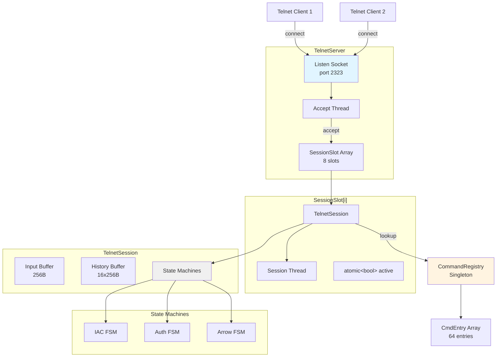
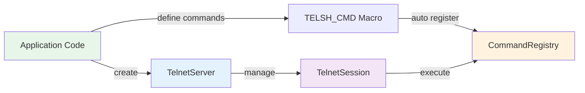
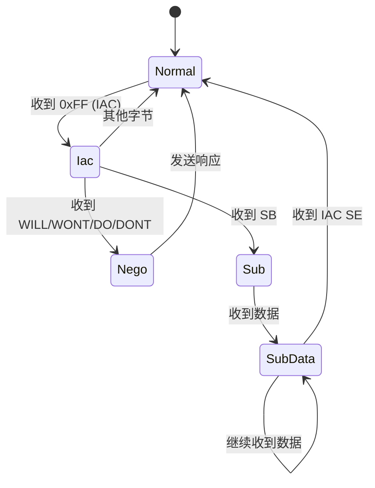
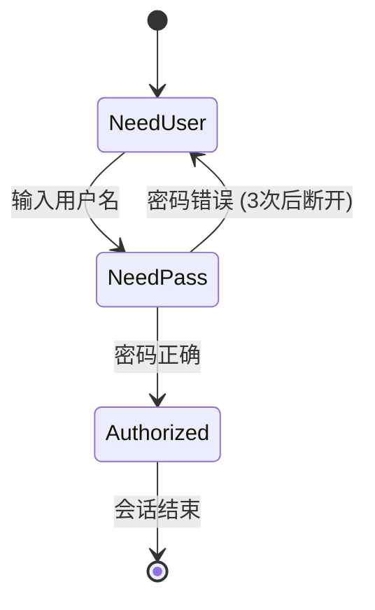
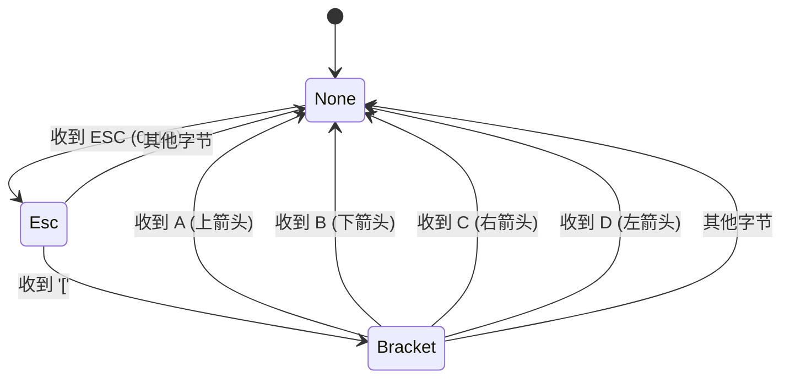
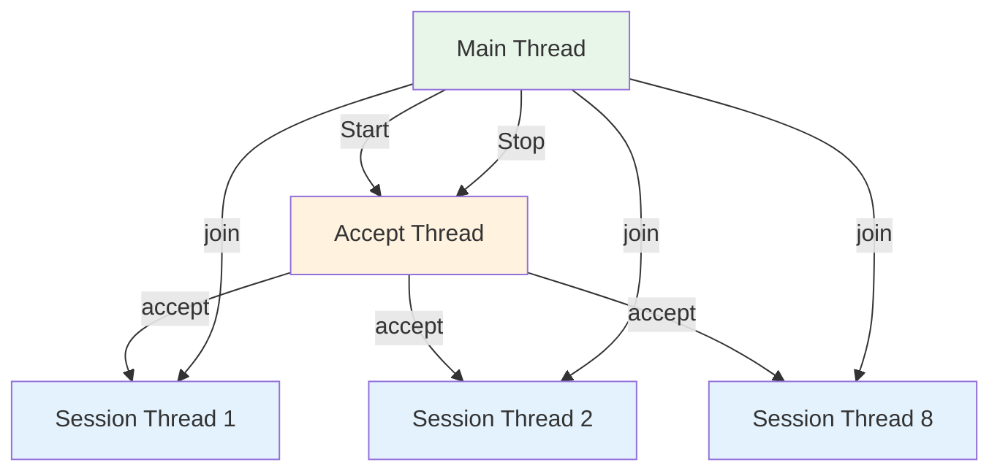

# telsh 设计文档

## 1. 概述

telsh 是一个轻量级、零堆分配的嵌入式 Telnet Shell 库，专为资源受限的嵌入式 Linux 系统设计。它提供了完整的 Telnet 协议支持、命令注册机制、会话管理和用户认证功能。

### 核心特性

- **零堆分配**: 所有数据结构使用固定容量数组，无动态内存分配
- **Header-only**: 单头文件设计，易于集成
- **线程安全**: 命令注册和查找使用互斥锁保护
- **完整 Telnet 协议**: 支持 IAC 协商、流控、箭头键导航
- **命令历史**: 固定 16 条历史记录，支持上下箭头导航
- **用户认证**: 用户名/密码两阶段认证，密码输入掩码
- **自动注册**: 通过宏实现命令的静态自动注册
- **资源可控**: 固定 8 个并发会话，每会话 ~4.5KB 内存

### 技术栈

- C++17
- POSIX Socket API
- 标准库: `<thread>`, `<mutex>`, `<atomic>`
- 编译选项: `-fno-exceptions -fno-rtti` (可选)

## 2. 设计目标

### 2.1 功能目标

1. **嵌入式友好**: 内存占用可预测，无动态分配
2. **易于集成**: Header-only 设计，最小化依赖
3. **协议完整**: 支持标准 Telnet 客户端 (PuTTY, telnet, nc)
4. **开发便利**: 宏驱动的命令注册，类似 Linux shell 的用户体验
5. **生产就绪**: 认证、会话管理、资源限制

### 2.2 非功能目标

1. **性能**: 单会话吞吐 > 1MB/s (本地回环)
2. **延迟**: 命令响应 < 10ms (无阻塞操作)
3. **资源**: 总内存 < 50KB，最多 9 个线程 (1 accept + 8 session)
4. **可靠性**: 异常连接不影响其他会话，优雅关闭

## 3. 架构总览

### 3.1 系统架构



### 3.2 模块依赖关系



## 4. 模块设计

### 4.1 CommandRegistry (command_registry.hpp)

#### 职责

- 命令注册和查找
- 统一命令签名管理
- 内置 `help` 命令
- 线程安全的命令表访问

#### 关键数据结构

```cpp
struct CmdEntry {
    char name[32];           // 命令名称
    CmdFn fn;                // 命令函数指针
    char desc[64];           // 命令描述
};

using CmdFn = int (*)(int argc, char* argv[], void* ctx);
using OutputFn = void (*)(const char* str, uint32_t len, void* ctx);
```

#### 核心功能

1. **命令注册**
   - `Register(name, fn, desc)`: 注册命令到固定数组
   - 容量: 64 个命令
   - 重复注册检测: 返回 false

2. **命令查找**
   - `Find(name)`: 线性查找，返回 `CmdFn` 或 `nullptr`
   - 时间复杂度: O(n)，n ≤ 64

3. **命令执行**
   - `Execute(cmdline, output_fn, ctx)`: 解析并执行命令
   - 调用 `ShellSplit` 原地解析参数
   - 调用命令函数，传递 `argc/argv/ctx`

4. **自动注册机制**
   ```cpp
   struct CmdAutoReg {
       CmdAutoReg(const char* name, CmdFn fn, const char* desc) {
           CommandRegistry::Instance().Register(name, fn, desc);
       }
   };

   #define TELSH_CMD(name, desc) \
       static int telsh_cmd_##name(int, char**, void*); \
       static CmdAutoReg telsh_reg_##name(#name, telsh_cmd_##name, desc); \
       static int telsh_cmd_##name(int argc, char* argv[], void* ctx)
   ```

#### 线程安全

- `std::mutex cmd_mutex_`: 保护 `entries_` 数组和 `count_`
- 注册和查找时持有锁
- 执行时不持有锁 (命令函数自行保证线程安全)

#### ShellSplit 解析器

- **功能**: 原地解析命令行，支持引号和转义
- **支持特性**:
  - 单引号: `'literal string'`
  - 双引号: `"string with spaces"`
  - 转义: `\"`, `\'`, `\\`
- **限制**: 最多 32 个参数
- **实现**: 状态机驱动，零堆分配


### 4.2 TelnetSession (telnet_session.hpp)

#### 职责

- 单个 Telnet 连接的会话管理
- IAC 协议处理
- 用户认证
- 命令行编辑 (箭头键、历史记录)
- 命令执行

#### 状态机设计

##### IAC 协议状态机



**状态说明**:
- `kNormal`: 正常数据接收
- `kIac`: 收到 IAC (0xFF)，等待命令字节
- `kNego`: 收到 WILL/WONT/DO/DONT，等待选项字节
- `kSub`: 收到 SB，进入子协商模式
- 处理逻辑: 拒绝所有选项 (DONT/WONT)，忽略子协商数据

##### 认证状态机



**状态说明**:
- `kNeedUser`: 等待输入用户名
- `kNeedPass`: 等待输入密码 (显示 `*` 掩码)
- `kAuthorized`: 认证通过，可执行命令
- 失败处理: 3 次密码错误后断开连接

##### 箭头键状态机



**功能映射**:
- `ESC[A`: 上箭头 → 历史记录向前
- `ESC[B`: 下箭头 → 历史记录向后
- `ESC[C`: 右箭头 → 光标右移 (未实现)
- `ESC[D`: 左箭头 → 光标左移 (未实现)

#### 关键数据结构

```cpp
class TelnetSession {
private:
    int fd_;                          // Socket 文件描述符
    std::atomic<bool> running_;       // 运行标志
    
    // 认证状态
    enum class Auth { kNeedUser, kNeedPass, kAuthorized };
    Auth auth_;
    char user_buf_[64];
    uint32_t user_len_;
    uint32_t pass_tries_;             // 密码尝试次数
    
    // 命令缓冲
    static constexpr uint32_t kMaxCmdLen = 256;
    char cmd_buf_[kMaxCmdLen];
    uint32_t cmd_len_;
    
    // 历史记录
    static constexpr uint32_t kHistorySize = 16;
    char history_[kHistorySize][kMaxCmdLen];
    uint32_t history_count_;
    int32_t history_idx_;             // -1 表示当前输入
    
    // IAC 状态
    enum class IacPhase { kNormal, kIac, kNego, kSub };
    IacPhase iac_phase_;
    
    // 箭头键状态
    enum class ArrowPhase { kNone, kEsc, kBracket };
    ArrowPhase arrow_phase_;
    
    // 流控
    bool xoff_;                       // Ctrl+S 暂停
};
```

#### 核心功能

1. **初始化**
   - `Init(fd, user, pass)`: 设置 socket、认证信息
   - 发送欢迎消息和用户名提示

2. **主循环**
   - `Run()`: 阻塞读取 socket，处理每个字节
   - 调用 `ProcessByte()` 驱动状态机
   - 异常时自动退出循环

3. **字节处理**
   - `ProcessByte(ch)`: 根据当前状态分发处理
   - IAC 协议优先级最高
   - 认证状态次之
   - 命令编辑最后

4. **命令执行**
   - `ExecuteCommand()`: 调用 `CommandRegistry::Execute()`
   - 通过 `SessionOutput` 适配器桥接输出
   - 添加到历史记录 (去重最近一条)

5. **历史导航**
   - `HistoryUp()`: 向前翻历史，保存当前输入
   - `HistoryDown()`: 向后翻历史，恢复当前输入
   - 边界处理: 到达首尾时不响应

6. **输出适配**
   ```cpp
   struct SessionOutput {
       TelnetSession* sess;
       static void Callback(const char* str, uint32_t len, void* ctx) {
           auto* out = static_cast<SessionOutput*>(ctx);
           out->sess->Send(str, len);
       }
   };
   ```

#### 特殊字符处理

| 字符 | ASCII | 功能 |
|------|-------|------|
| `\r` | 0x0D | 执行命令 |
| `\n` | 0x0A | 忽略 (Windows CRLF) |
| `\b` / `0x7F` | 0x08 / 0x7F | 退格删除 |
| `Ctrl+C` | 0x03 | 清空当前行 |
| `Ctrl+D` | 0x04 | 退出会话 |
| `Ctrl+S` | 0x13 | 暂停输出 (XOFF) |
| `Ctrl+Q` | 0x11 | 恢复输出 (XON) |
| `ESC[A` | 0x1B 0x5B 0x41 | 上箭头 |
| `ESC[B` | 0x1B 0x5B 0x42 | 下箭头 |

#### 线程安全

- 每个会话独立线程，无共享状态
- 仅通过 `CommandRegistry` 单例交互 (已加锁)
- `running_` 使用 `std::atomic<bool>`


### 4.3 TelnetServer (telnet_server.hpp)

#### 职责

- 监听 TCP 端口，接受连接
- 管理固定数量的会话槽位
- 会话线程生命周期管理
- 广播消息到所有活跃会话
- 全局 `tel_printf()` 支持

#### 关键数据结构

```cpp
struct SessionSlot {
    TelnetSession session;
    std::thread thread;
    std::atomic<bool> active;
};

class TelnetServer {
private:
    static constexpr uint32_t kMaxSessions = 8;
    
    int listen_fd_;
    std::atomic<bool> running_;
    std::thread accept_thread_;
    
    SessionSlot slots_[kMaxSessions];
    
    std::string username_;
    std::string password_;
    
    static TelnetServer* g_instance_;  // 全局单例指针
};
```

#### 核心功能

1. **启动服务**
   - `Start(port, user, pass)`: 创建监听 socket，启动 accept 线程
   - 设置 `SO_REUSEADDR` 选项
   - 绑定到 `0.0.0.0:port`
   - 设置全局单例指针 `g_instance_`

2. **接受连接**
   - `AcceptLoop()`: 循环 `accept()` 新连接
   - 调用 `FindFreeSlot()` 查找空闲槽位
   - 满载时发送 `"Server full.\r\n"` 并关闭连接
   - 初始化会话并启动线程

3. **槽位管理**
   - `FindFreeSlot()`: 线性扫描 `active` 标志
   - 返回索引或 -1 (无空闲)
   - 时间复杂度: O(8)

4. **停止服务**
   - `Stop()`: 优雅关闭所有资源
   - 步骤:
     1. 设置 `running_ = false`
     2. 关闭 `listen_fd_` (唤醒 `accept()`)
     3. `join()` accept 线程
     4. 调用所有会话的 `Stop()`
     5. `join()` 所有会话线程
     6. 清空 `g_instance_`

5. **广播消息**
   - `Broadcast(data, len)`: 遍历所有 `active` 槽位，调用 `Send()`
   - `BroadcastPrintf(fmt, ...)`: 格式化后广播
   - 线程安全: 每个会话的 `Send()` 独立

6. **全局输出**
   - `Printf(fmt, ...)`: 通过 `g_instance_` 广播
   - `tel_printf(fmt, ...)`: 全局便利函数
   - 用途: 异步事件通知所有客户端

#### 线程模型



**线程说明**:
- **Main Thread**: 调用 `Start()` 和 `Stop()`，不阻塞
- **Accept Thread**: 阻塞在 `accept()`，接受新连接
- **Session Threads**: 每个连接一个线程，阻塞在 `recv()`
- **同步点**: `Stop()` 时 join 所有线程

#### 资源限制

| 资源 | 限制 | 说明 |
|------|------|------|
| 并发会话 | 8 | 固定槽位数组 |
| 监听队列 | 5 | `listen(fd, 5)` |
| 端口 | 2323 | 默认值，可配置 |
| 线程数 | 9 | 1 accept + 8 session |

#### 错误处理

1. **端口占用**: `Start()` 返回 `false`，打印错误
2. **连接满载**: 发送提示消息，关闭新连接
3. **会话异常**: 自动清理槽位，不影响其他会话
4. **停止超时**: 无超时机制，依赖线程正常退出

## 5. 关键数据结构

### 5.1 内存布局

```
CommandRegistry (单例)
├── CmdEntry entries_[64]          2KB
│   ├── char name[32]
│   ├── CmdFn fn
│   └── char desc[64]
├── uint32_t count_
└── std::mutex cmd_mutex_

TelnetServer
├── SessionSlot slots_[8]          ~36KB
│   ├── TelnetSession session      ~4.5KB
│   │   ├── char cmd_buf_[256]     256B
│   │   ├── char history_[16][256] 4KB
│   │   ├── char user_buf_[64]     64B
│   │   └── 状态变量               ~100B
│   ├── std::thread thread
│   └── atomic<bool> active
├── int listen_fd_
├── std::thread accept_thread_
└── 认证信息                        ~100B

总计: ~40KB
```

### 5.2 性能特征

| 操作 | 时间复杂度 | 空间复杂度 |
|------|-----------|-----------|
| 命令注册 | O(n), n≤64 | O(1) |
| 命令查找 | O(n), n≤64 | O(1) |
| 命令执行 | O(m), m=命令复杂度 | O(1) |
| 历史添加 | O(1) | O(1) |
| 历史导航 | O(1) | O(1) |
| 槽位查找 | O(8) | O(1) |
| 广播消息 | O(k), k=活跃会话数 | O(1) |

### 5.3 缓存友好性

- **CommandRegistry**: 数组连续存储，查找时缓存友好
- **TelnetSession**: 热路径数据 (cmd_buf, cmd_len) 紧凑布局
- **SessionSlot**: 每个槽位独立缓存行，避免伪共享

## 6. 接口文档

### 6.1 CommandRegistry

#### Register

```cpp
bool Register(const char* name, CmdFn fn, const char* desc = "");
```

**参数**:
- `name`: 命令名称，最长 31 字节
- `fn`: 命令函数指针
- `desc`: 命令描述，最长 63 字节

**返回值**:
- `true`: 注册成功
- `false`: 命令已存在或数组已满

**线程安全**: 是 (内部加锁)

#### Find

```cpp
CmdFn Find(const char* name) const;
```

**参数**:
- `name`: 命令名称

**返回值**:
- 命令函数指针，未找到返回 `nullptr`

**线程安全**: 是 (内部加锁)

#### Execute

```cpp
int Execute(const char* cmdline, OutputFn output_fn, void* ctx);
```

**参数**:
- `cmdline`: 命令行字符串
- `output_fn`: 输出回调函数
- `ctx`: 回调上下文指针

**返回值**:
- 命令函数的返回值
- `-1`: 命令未找到或解析失败

**线程安全**: 是 (查找加锁，执行不加锁)

### 6.2 TelnetSession

#### Init

```cpp
void Init(int fd, const std::string& user, const std::string& pass);
```

**参数**:
- `fd`: 已连接的 socket 文件描述符
- `user`: 用户名
- `pass`: 密码

**返回值**: 无

**线程安全**: 否 (仅在启动前调用)

#### Run

```cpp
void Run();
```

**功能**: 会话主循环，阻塞直到连接关闭

**返回值**: 无

**线程安全**: 否 (独立线程)

#### Stop

```cpp
void Stop();
```

**功能**: 设置停止标志，唤醒 `Run()` 循环

**返回值**: 无

**线程安全**: 是 (使用 `atomic<bool>`)

#### Send

```cpp
void Send(const char* data, uint32_t len);
```

**参数**:
- `data`: 数据指针
- `len`: 数据长度

**返回值**: 无

**线程安全**: 是 (socket 写入原子性)

### 6.3 TelnetServer

#### Start

```cpp
bool Start(uint16_t port, const std::string& user, const std::string& pass);
```

**参数**:
- `port`: 监听端口
- `user`: 认证用户名
- `pass`: 认证密码

**返回值**:
- `true`: 启动成功
- `false`: 端口绑定失败

**线程安全**: 否 (仅在主线程调用一次)

#### Stop

```cpp
void Stop();
```

**功能**: 停止服务器，等待所有线程退出

**返回值**: 无

**线程安全**: 是 (可从任意线程调用)

#### Broadcast

```cpp
void Broadcast(const char* data, uint32_t len);
```

**参数**:
- `data`: 数据指针
- `len`: 数据长度

**返回值**: 无

**线程安全**: 是 (遍历槽位无锁)

#### BroadcastPrintf

```cpp
void BroadcastPrintf(const char* fmt, ...);
```

**参数**:
- `fmt`: printf 格式字符串
- `...`: 可变参数

**返回值**: 无

**线程安全**: 是

#### Printf (静态)

```cpp
static void Printf(const char* fmt, ...);
```

**功能**: 通过全局单例广播消息

**返回值**: 无

**线程安全**: 是 (依赖 `g_instance_` 非空)

### 6.4 全局函数

#### tel_printf

```cpp
void tel_printf(const char* fmt, ...);
```

**功能**: 便利函数，等价于 `TelnetServer::Printf()`

**返回值**: 无

**线程安全**: 是

## 7. 资源预算

### 7.1 内存占用

| 组件 | 静态内存 | 栈内存 | 堆内存 | 总计 |
|------|---------|--------|--------|------|
| CommandRegistry | 2KB | - | 0 | 2KB |
| TelnetServer (基础) | 200B | - | 0 | 200B |
| SessionSlot[8] | 36KB | - | 0 | 36KB |
| 线程栈 (9个) | - | 72KB | 0 | 72KB |
| **总计** | **38KB** | **72KB** | **0** | **110KB** |

**说明**:
- 静态内存: 全局/静态变量
- 栈内存: 线程栈 (默认 8KB/线程)
- 堆内存: 零动态分配

### 7.2 文件描述符

| 资源 | 数量 | 说明 |
|------|------|------|
| 监听 socket | 1 | `listen_fd_` |
| 会话 socket | 0-8 | 每个活跃会话一个 |
| **总计** | **1-9** | 峰值 9 个 |

### 7.3 线程资源

| 线程 | 数量 | 优先级 | CPU 亲和性 |
|------|------|--------|-----------|
| Accept | 1 | 默认 | 无 |
| Session | 0-8 | 默认 | 无 |
| **总计** | **1-9** | - | - |

## 8. 与原始实现对比

### 8.1 原始 shell.hpp 实现

**特点**:
- 单线程事件循环 (epoll)
- 最多 4 个并发连接
- 无认证机制
- 简化的 IAC 处理
- 无命令历史
- 代码量: ~300 行

**优势**:
- 更轻量 (单线程)
- 更低延迟 (无锁)
- 更简单 (无状态机)

**劣势**:
- 功能受限
- 无生产级特性
- 扩展性差

### 8.2 telsh 实现

**特点**:
- 多线程架构 (每连接一线程)
- 最多 8 个并发连接
- 完整认证流程
- 完整 IAC 协议支持
- 命令历史 + 箭头键导航
- 代码量: ~800 行

**优势**:
- 功能完整
- 生产就绪
- 易于扩展
- 标准 Telnet 兼容

**劣势**:
- 更高内存占用 (~110KB vs ~20KB)
- 更多线程开销
- 更复杂的代码

### 8.3 选择建议

| 场景 | 推荐方案 | 理由 |
|------|---------|------|
| 调试工具 | shell.hpp | 轻量、快速 |
| 生产环境 | telsh | 安全、完整 |
| 资源受限 (<100KB RAM) | shell.hpp | 内存占用小 |
| 多用户场景 | telsh | 认证 + 会话隔离 |
| 标准客户端 (PuTTY) | telsh | 协议兼容性好 |

## 9. 使用示例

### 9.1 基本用法

```cpp
#include "telsh/telnet_server.hpp"

// 定义命令
TELSH_CMD(hello, "Print hello message") {
    tel_printf("Hello from command!\n");
    return 0;
}

TELSH_CMD(echo, "Echo arguments") {
    for (int i = 1; i < argc; ++i) {
        tel_printf("%s ", argv[i]);
    }
    tel_printf("\n");
    return 0;
}

int main() {
    TelnetServer server;
    if (!server.Start(2323, "admin", "secret")) {
        return 1;
    }

    // 运行直到 Ctrl+C
    std::this_thread::sleep_for(std::chrono::hours(24));
    server.Stop();
    return 0;
}
```

### 9.2 自定义输出

```cpp
TELSH_CMD(status, "Show system status") {
    auto* out = static_cast<TelnetSession::SessionOutput*>(ctx);
    
    char buf[256];
    int len = snprintf(buf, sizeof(buf), 
        "CPU: 45%%\nMemory: 128MB\nUptime: 3600s\n");
    
    out->sess->Send(buf, len);
    return 0;
}
```

### 9.3 异步通知

```cpp
void event_handler() {
    // 从任意线程调用
    tel_printf("[EVENT] Sensor triggered at %ld\n", time(nullptr));
}
```

## 10. 未来扩展

### 10.1 计划功能

1. **SSL/TLS 支持**: 加密传输
2. **多用户管理**: 用户数据库，权限控制
3. **命令补全**: Tab 键补全命令名
4. **光标编辑**: 左右箭头移动光标，插入/删除
5. **会话日志**: 记录所有命令和输出
6. **配置文件**: 从文件加载端口、用户等配置

### 10.2 性能优化

1. **命令哈希表**: 替代线性查找，O(1) 查找
2. **零拷贝输出**: `sendfile()` 或 `splice()`
3. **线程池**: 复用线程，避免频繁创建/销毁
4. **批量广播**: 合并多个 `Printf()` 调用

### 10.3 兼容性

1. **Windows 支持**: Winsock API 适配
2. **IPv6 支持**: `AF_INET6` socket
3. **Unix Domain Socket**: 本地 IPC

## 11. 参考资料

- [RFC 854: Telnet Protocol Specification](https://tools.ietf.org/html/rfc854)
- [RFC 855: Telnet Option Specifications](https://tools.ietf.org/html/rfc855)
- [POSIX Socket API](https://pubs.opengroup.org/onlinepubs/9699919799/basedefs/sys_socket.h.html)
- [Linux Programming Interface (Chapter 59-61)](https://man7.org/tlpi/)

---

**文档版本**: v1.0  
**最后更新**: 2026-02-15  
**作者**: dgliu
